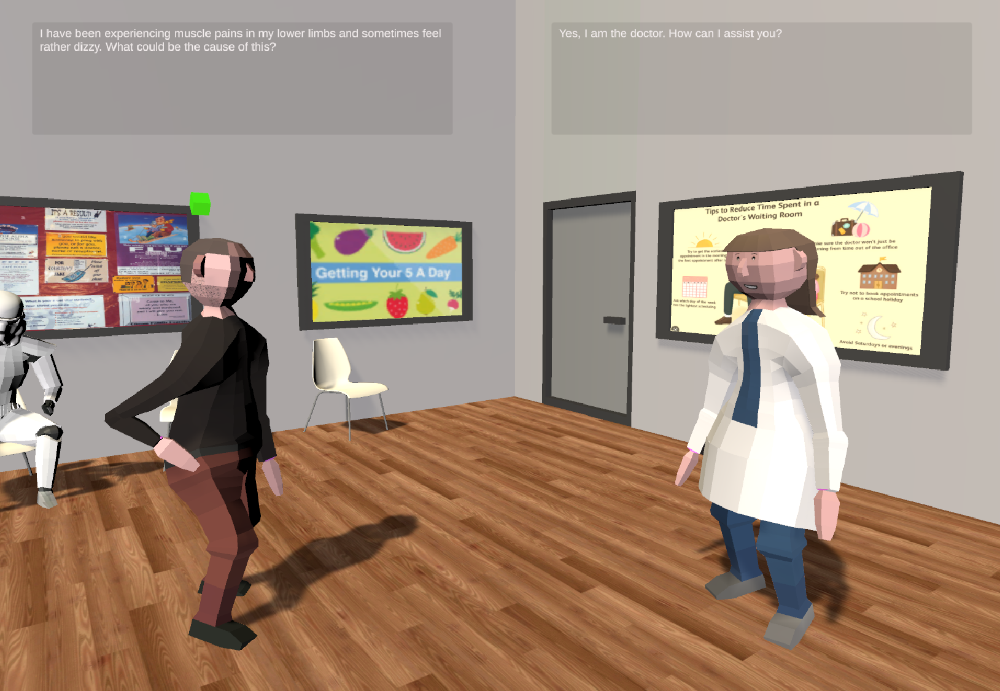
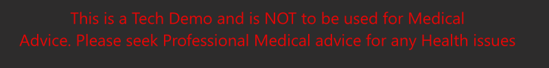

## Doctor Bot and the Impatient Patient ##
A bit of a goof around with the OpenAI GPT API, in an attempt to emulate automated conversation between two NPCs.
I have also used the Google Text to Speech API service to animate the Voices, of the returned Chat textual conversations. 

## Video Demonstration ##
Please see the [brief You Tube Video demonstration here](https://www.youtube.com/watch?v=rAbuMg2NdRY)  

Another example, using very similar code base: [A debate on the Pros and cons of AI.](https://www.youtube.com/watch?v=8zPgAVHOtLs) 

## Unity Scene and Open AI Developent ##

The basic scene is set up in Unity, with two characters, a Doctor and a Patient.  A basic User Interface is set up 
for manual patient requests to the doctor. Text Boxes for the responses from the Doctor and patient Chat. Please install the enclosed Unity Asset Package into your Unity Porject to set up this scene and characters.  

The conversations are invoked through calls into the [Open AI GPT API service](https://platform.openai.com/docs/api-reference/introduction). You will need your own API key from Open AI. My own key has been installed as a System Environmental Variable, which I call into from my source code. Following [Immersive Limits example](https://www.youtube.com/watch?v=gI9QSHpiMW0&lc=Ugy_k18DMwZl-9Kw25J4AaABAg) I downloaded the   [OKGoDolt C# wrapper](https://github.com/OkGoDoIt/OpenAI-API-dotnet) for the Open AI calls, and copied this into the Unity project. This enables us to call Open AI GPT API from within Unity C# scripts. 

There are four Unity script files:
-   IntroManager.CS         :  This just manages the MainIntroduction Screen Selection
-   TeacherContoller.CS     :  This is a simple Animator controller for the Patient Character 
-   DoctorContoller.CS      :  This is a simple Animator controller for the Doctor Character
-   DialogueController.CS   :  This is the main Conversation coordinator. It invokes the Open AI calls, and coordinates the conversation between the Patient and the Doctor. 

In basic manual mode, I simply invoke a single Doctor Message queue chat sequence, from user prompts entered into the Input Text Box. The Doctor chat message queue, is initialised with a short System Role message, to set a context for the Doctors chat. I ask for short and succint answers, to any patient queries.  

In the "Automatic", Conversational mode I have a two seperate Chat message queue, one for the Doctor and another for the Patient. I initialise each with a System role message, to set the context for each character. I then roll the sequences of messages across and into both Message queues, as the conversation progresses. The chat responses from one, provoking the next response from the other character chat.

The use of Google Text to Speech API, will require a Google Cloud Account, cloud Project and the apppriate key to be created.  I have used the [FrostWeep Games Text to Speech Unity Asset](https://assetstore.unity.com/packages/add-ons/machinelearning/text-to-speech-using-google-cloud-pro-115170#description) to synthesise the Text returns into Voices. They are a bunch of Ukrainian developers and so deserve our support.  Note as paid Unity Asset I have removed the Frostweep files from my project uploaded here. So if you want these synthesised voices, you will have to buy and re install that Asset files from the Unity Asset Store into the project directory.  You then assign the Google API key into the Prefab Component.  

## Results ##

The results are quite fun. I had set Max Token limits in each call to curtail the reponses. However I found that if some of the Doctors responses were long, they were truncted. The consequence of truncating the Doctors response, resulted in the Patients response, then continuing the Doctors previous output. So the Patient was completing the Doctors responses, by virtue of the GPT Language Model, literally completing the next likely word sequence of the conversation. So the Patient to Doctor conversation became confused, with the patient, competing Doctors statements. 

So I have removed the MaxTokens parameter from my Chat Request calls, in an attempt to avoid Doctor resposnes being truncated, and the Patient completing them. 

When the conversation comes to a natural end, the characters end up in a cycle of passing goodbye and pleasantries between each other. So I have set an artificial conversation/ chat limit of 20. 

## Further Work and Development ##
[RL Hugh Control of NPCs with GPT3](https://www.youtube.com/watch?v=RSzeqjKJABk&t=10s) demonstrates how the OPEN AI Chat responses can be encoded, with Action keywords, to provoke Actions in your game or scenario. 

A deeper understanding of Transformers and Deep Language models is described in the [Andrej Karpathy series of code tutorials](https://www.youtube.com/watch?v=kCc8FmEb1nY&t=2080s) 

## Acknowledgements ##

- [Open AI GPT API Service](https://platform.openai.com/docs/api-reference/introduction)
- [OKGoDolt A C# Wrapper for OPEN AI Calls](https://github.com/OkGoDoIt/OpenAI-API-dotnet)
- [FrostWeep Games: Google Text to Speech Wrapper Asset]( https://assetstore.unity.com/packages/add-ons/machinelearning/text-to-speech-using-google-cloud-pro-115170#description)
- [Immersive limit ChatGPT in Unity](https://www.youtube.com/watch?v=gI9QSHpiMW0&lc=Ugy_k18DMwZl-9Kw25J4AaABAg)
- [RL Hugh Control of NPCs with GPT3](https://www.youtube.com/watch?v=RSzeqjKJABk&t=10s)
- [Andrej Karpathy Let Build GPT from scratch, in code, spelled out](https://www.youtube.com/watch?v=kCc8FmEb1nY&t=2080s)

